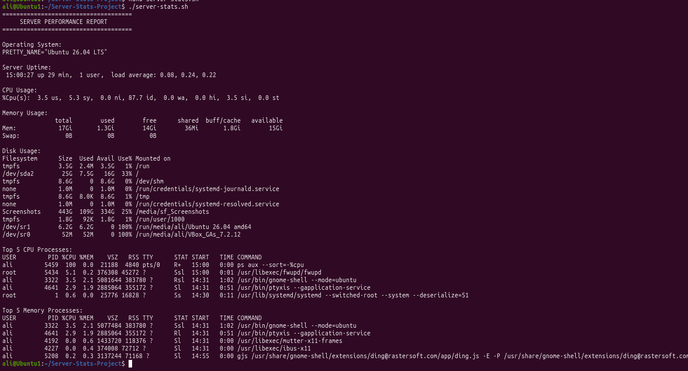

# Server Performance Stats

A Bash script that analyzes basic Linux server performance statistics.

## Screenshot



---

## Features

- Displays Operating System information
- Displays Server Uptime
- Displays CPU Usage
- Displays Memory Usage (Used and Free)
- Displays Disk Usage (Used and Free)
- Displays Top 5 Processes by CPU Usage
- Displays Top 5 Processes by Memory Usage

---

## Technologies Used

- Linux
- Bash
- Git
- GitHub

---


---

## How to Run

Clone the repository:

```bash
git clone https://github.com/YOUR_USERNAME/Server-Stats-Project.git
```

Go into the project folder:

```bash
cd Server-Stats-Project
```

Give the script permission to execute:

```bash
chmod +x server-stats.sh
```

Run the script:

```bash
./server-stats.sh
```

---

## Example Output

The script displays information similar to:

- Operating System
- Server Uptime
- CPU Usage
- Memory Usage
- Disk Usage
- Top 5 CPU Processes
- Top 5 Memory Processes

---

## Skills Learned

- Bash scripting
- Linux system administration
- Server monitoring
- Linux commands
- Git and GitHub

---

## Author

**Ali Abakar**